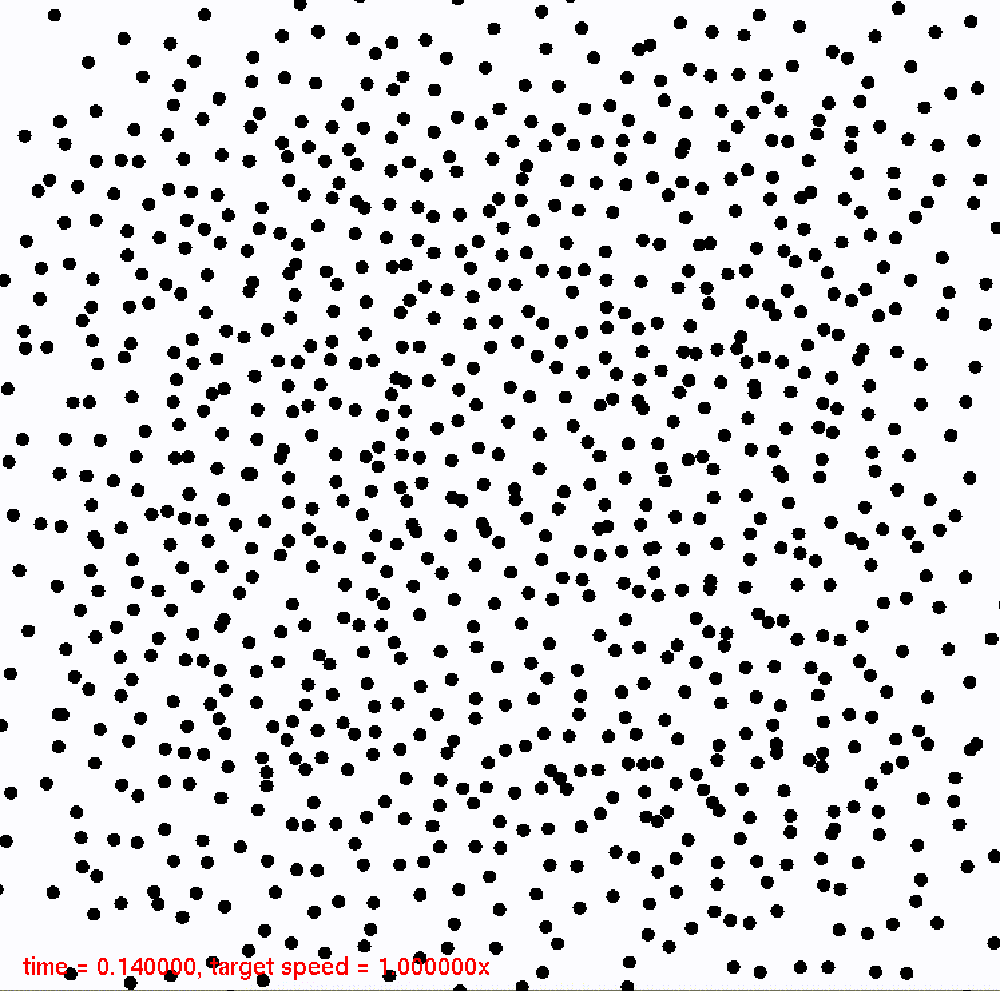

# sph
This program simulates a two-dimensional fluid using the SPH method.
SPH stands for <a href="https://en.wikipedia.org/wiki/Smoothed-particle_hydrodynamics">smoothed particle hydrodynamics</a>.
An ordinary laptop should be able to run simulations with up to a few thousand particles in real time.

# Building and running

Requires C++17, GNU Make and <a href="http://freeglut.sourceforge.net">freeglut</a>.
On MacOS, using <a href="https://brew.sh">Homebrew</a>, freeglut can be installed with
```
brew install freeglut
```
To build and run the program, execute
```
make run
```
from this repository's root folder.

# Demo

